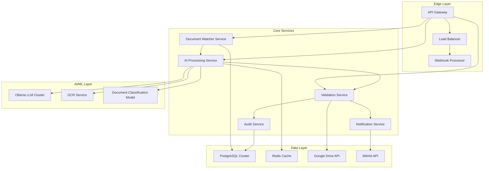
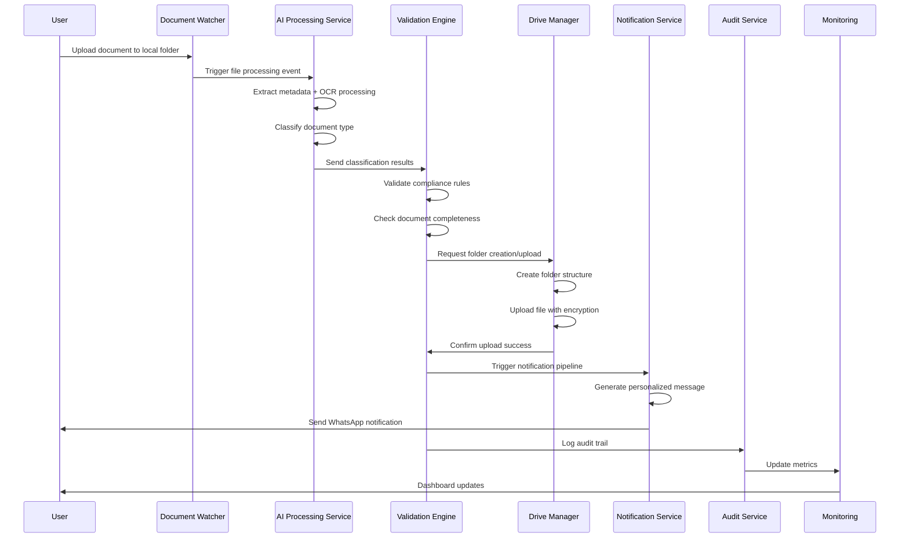

# 🧩 PRD: AI-Driven Legal Document Automation System v2.0

**(Integrasi Google Drive + WAHA + Local AI Agent + Enhanced Security & Modern Architecture)**

## 📘 1. Executive Overview

Sistem ini adalah next-generation AI-based automation agent yang dirancang untuk mengelola dokumen legal perusahaan dengan keamanan enterprise-grade dan kemampuan AI yang canggih. Sistem secara otomatis memproses dokumen dari folder lokal, mengunggahnya ke Google Drive dengan struktur terstandarisasi, melakukan validasi kelengkapan dokumen menggunakan machine learning, dan mengirim notifikasi real-time via WhatsApp melalui WAHA API.

**🚀 Key Enhancements v2.0:**
- Zero-trust security architecture dengan end-to-end encryption
- Multi-modal AI processing (text + OCR + document understanding)
- Real-time collaboration & conflict resolution
- Advanced audit trail & compliance reporting
- Microservices architecture dengan container deployment
- Enhanced error handling & recovery mechanisms

## 🎯 2. Strategic Goals & Success Metrics

| Goal | Description | Success Metrics | Target KPI |
|------|-------------|----------------|------------|
| 📁 **Intelligent Document Automation** | Otomatisasi end-to-end dari folder lokal ke Google Drive dengan klasifikasi AI | - Dokumen terproses otomatis: >95%<br>- Struktur folder akurasi: 100%<br>- Processing time: <30 detik/dokumen | 24/7 processing capability |
| 🧠 **Advanced AI Understanding** | Multi-modal AI processing dengan NLP, OCR, dan document understanding | - Command understanding accuracy: >98%<br>- OCR accuracy: >95%<br>- Document classification: >97% | Support 3+ languages |
| 🔍 **Smart Compliance Validation** | Real-time compliance checking dengan rule-based engine + ML | - Missing document detection: 100%<br>- False positive rate: <2%<br>- Compliance score accuracy: >95% | Zero compliance violations |
| 💬 **Intelligent Notification System** | Context-aware WhatsApp notifications dengan personalization | - Delivery rate: >99%<br>- Response rate: >80%<br>- Notification relevance: >90% | <5 minute response time |
| 🛡️ **Enterprise Security & Compliance** | Zero-trust architecture dengan SOC2 Type II compliance | - Security incidents: 0<br>- Data encryption: 100%<br>- Audit trail completeness: 100% | ISO 27001 & SOC2 certified |
| 🪄 **Multi-AI Collaboration Platform** | Seamless integration dengan Claude Code, GPT-5, Copilot, Replit AI | - API uptime: >99.9%<br>- Integration success rate: >98%<br>- Developer satisfaction: >90% | Support 5+ AI platforms |
## 🏗️ 3. Modern Architecture Overview

### 🔄 Microservices Architecture Pattern



### 🧩 Enhanced Component Architecture

| Service | Function | Technology Stack | Scaling Strategy |
|---------|----------|------------------|------------------|
| **Document Watcher Service** | Real-time file monitoring dengan event streaming | Python + Watchdog + Apache Kafka | Horizontal scaling with partitioned topics |
| **AI Processing Service** | Multi-modal AI processing pipeline | FastAPI + Ollama + Tesseract OCR + Transformers | GPU scaling with model sharding |
| **Validation Engine** | Rule-based + ML compliance checking | Python + Scikit-learn + Custom rules engine | Multi-instance with consistent hashing |
| **Notification Service** | Smart WhatsApp notifications dengan templates | Node.js + WAHA API + Template Engine | Queue-based with retry mechanisms |
| **Audit & Compliance Service** | Comprehensive logging & compliance reporting | Python + ELK Stack + PostgreSQL | Time-series partitioning |
| **Security Gateway** | Zero-trust security dengan mTLS | Kong API Gateway + OAuth2 + JWT | High availability with failover |
| **Configuration Service** | Centralized configuration management | Consul + Vault | Distributed configuration |
| **Monitoring & Observability** | Full-stack monitoring dengan APM | Prometheus + Grafana + Jaeger | Multi-region monitoring |
## ⚙️ 4. Enhanced Workflow & Data Flow

### 🔄 Comprehensive Workflow Pipeline



### 📊 Advanced Processing Pipeline

1. **Ingestion Layer**:
   - Real-time file monitoring dengan debouncing
   - File type validation & security scanning
   - Metadata extraction & preprocessing

2. **AI Processing Layer**:
   - Multi-modal analysis (text + visual)
   - Document understanding dengan transformer models
   - Entity extraction & relationship mapping

3. **Validation Layer**:
   - Rule-based compliance checking
   - Machine learning anomaly detection
   - Cross-reference validation

4. **Storage Layer**:
   - Encrypted file storage
   - Hierarchical folder management
   - Version control & backup

5. **Notification Layer**:
   - Template-based message generation
   - Multi-channel delivery (WA, Email, Dashboard)
   - Escalation workflows

## 📂 5. Enhanced Project Structure (Microservices Architecture)

### 🏛️ Repository Structure

```
ai-legal-automation-v2/
├── 📁 services/                    # Microservices
│   ├── document-watcher/          # File monitoring service
│   │   ├── Dockerfile
│   │   ├── requirements.txt
│   │   ├── app.py
│   │   └── config/
│   ├── ai-processor/              # AI/ML processing service
│   │   ├── Dockerfile
│   │   ├── requirements.txt
│   │   ├── models/                 # Local ML models
│   │   ├── ollama_client.py
│   │   └── ocr_processor.py
│   ├── validation-engine/         # Compliance validation service
│   │   ├── Dockerfile
│   │   ├── rules/                 # Business rules
│   │   ├── ml_models/             # ML validation models
│   │   └── validators.py
│   ├── notification-service/      # WhatsApp/email notifications
│   │   ├── Dockerfile
│   │   ├── templates/             # Message templates
│   │   └── waha_client.py
│   └── audit-service/             # Logging & compliance
│       ├── Dockerfile
│       ├── loggers.py
│       └── compliance_checker.py
│
├── 📁 infrastructure/             # DevOps & deployment
│   ├── docker-compose.yml         # Local development
│   ├── docker-compose.prod.yml    # Production deployment
│   ├── kubernetes/                # K8s manifests
│   │   ├── namespace.yaml
│   │   ├── configmap.yaml
│   │   ├── secret.yaml
│   │   └── deployments/
│   ├── terraform/                 # Infrastructure as code
│   │   ├── main.tf
│   │   ├── variables.tf
│   │   └── modules/
│   └── monitoring/                # Observability stack
│       ├── prometheus.yml
│       ├── grafana/
│       └── jaeger/
│
├── 📁 shared/                     # Shared libraries
│   ├── security/                  # Security utilities
│   │   ├── encryption.py
│   │   ├── auth.py
│   │   └── rbac.py
│   ├── database/                  # Database models
│   │   ├── models.py
│   │   └── migrations/
│   ├── messaging/                 # Event bus utilities
│   │   ├── kafka_producer.py
│   │   └── redis_client.py
│   └── utils/                     # Common utilities
│       ├── validators.py
│       └── helpers.py
│
├── 📁 docs/                       # Documentation
│   ├── PRD.md                     # This document
│   ├── architecture/              # Architecture diagrams
│   ├── security/                  # Security specifications
│   ├── api/                       # API documentation
│   └── deployment/                # Deployment guides
│
├── 📁 scripts/                    # Automation scripts
│   ├── setup.sh                   # Environment setup
│   ├── deploy.sh                  # Deployment automation
│   └── backup.sh                  # Backup procedures
│
├── 📁 tests/                      # Test suites
│   ├── unit/                      # Unit tests
│   ├── integration/               # Integration tests
│   └── e2e/                       # End-to-end tests
│
├── 📁 config/                     # Configuration files
│   ├── .env.example               # Environment template
│   ├── docker-compose.override.yml
│   └── monitoring/
│
├── 📄 .github/                    # CI/CD pipelines
│   └── workflows/
│       ├── ci.yml
│       ├── cd.yml
│       └── security-scan.yml
│
└── 📄 README.md                   # Project documentation
```

### 🔐 Security & Configuration Files

```
📁 security/                       # Security configuration
├── certificates/                  # SSL/TLS certificates
├── secrets/                       # Encrypted secrets (Vault)
├── policies/                      # Security policies
│   ├── rbac.yaml                  # Role-based access control
│   ├── network-policy.yaml        # Network security
│   └── pod-security-policy.yaml   # Pod security
└── compliance/                    # Compliance configurations
    ├── soc2-controls.yaml
    ├── iso27001-controls.yaml
    └── gdpr-controls.yaml
```

## 🛡️ 6. Enterprise Security & Compliance Framework

### 🔒 Zero-Trust Security Architecture

**Multi-Layer Security Controls:**

| Security Layer | Controls | Implementation |
|----------------|----------|----------------|
| **Network Security** | mTLS, Network Segmentation, DDoS Protection | Istio Service Mesh + Cloudflare |
| **Application Security** | OWASP Top 10 Protection, Input Validation, Rate Limiting | Kong API Gateway + Custom WAF |
| **Data Security** | End-to-End Encryption, Data Masking, Tokenization | AES-256 + Vault secrets management |
| **Identity & Access** | OAuth2, JWT, RBAC, MFA | Keycloak + Biometric MFA |
| **Infrastructure Security** | Container Security, Immutable Infrastructure, Vulnerability Scanning | Falco + Trivy + CIS Benchmarks |

### 🛡️ Security Implementation Details

#### Authentication & Authorization
```yaml
# JWT Token Structure
{
  "sub": "user_id",
  "role": "legal_admin",
  "permissions": ["document:upload", "document:view", "validation:run"],
  "company_access": ["PT_JNI", "PT_ABC"],
  "exp": 1640995200,
  "iat": 1640908800
}

# RBAC Matrix
Role: legal_admin
- document:upload, view, delete
- validation:run, override
- notification:send, configure
- audit:view, export

Role: company_user
- document:upload, view (own company)
- validation:view
- notification:receive
```

#### Data Encryption Strategy
```yaml
# Encryption-at-Rest (AES-256)
database_encryption:
  algorithm: "AES-256-GCM"
  key_rotation: "quarterly"
  key_management: "HashiCorp Vault"

# Encryption-in-Transit (TLS 1.3)
transport_encryption:
  protocol: "TLS-1.3"
  cipher_suites: ["TLS_AES_256_GCM_SHA384"]
  certificate_management: "LetsEncrypt + cert-manager"
```

### 📋 Compliance Framework

#### SOC2 Type II Controls
```yaml
Security_Controls:
  - SC-1: Access Control Management
  - SC-2: System Boundary Protection
  - SC-3: Data Encryption & Protection
  - SC-4: Security Incident Response

Availability_Controls:
  - AC-1: System Redundancy (99.9% uptime)
  - AC-2: Disaster Recovery (RTO < 4 hours)
  - AC-3: Backup Verification

Processing_Integrity:
  - PI-1: Data Validation Controls
  - PI-2: Processing Accuracy
  - PI-3: Audit Trail Completeness

Confidentiality:
  - CC-1: Data Classification
  - CC-2: Need-to-Know Access
  - CC-3: Secure Data Transmission

Privacy:
  - PR-1: GDPR Compliance
  - PR-2: Data Subject Rights
  - PR-3: Privacy Impact Assessment
```

#### ISO 27001 Annex A Controls
```yaml
A.9 Access Control:
  - A.9.1: Business requirements for access control
  - A.9.2: User access management
  - A.9.3: User responsibilities
  - A.9.4: System and application access control

A.10 Cryptography:
  - A.10.1: Cryptographic controls
  - A.10.2: Key management lifecycle

A.12 Operations Security:
  - A.12.1: Operational procedures
  - A.12.2: Protection from malware
  - A.12.3: Backup management
  - A.12.4: Logging and monitoring
```

### 🔍 Security Monitoring & Incident Response

#### Real-time Security Monitoring
```yaml
Security_Monitoring:
  SIEM: "ELK Stack + Elastic Security"
  Threat_Detection: "CrowdStrike Falcon"
  Vulnerability_Management: "Tenable.io"
  Container_Security: "Aqua Security"

Alerting:
  Critical_Alerts: "PagerDuty (+5 min response)"
  Warning_Alerts: "Slack #security-alerts"
  Daily_Reports: "Email to security-team@company.com"
```

#### Incident Response Playbook
```yaml
Incident_Response_Tiers:
  Tier_1: "Security Analyst (0-2 hours)"
  Tier_2: "Security Engineer (2-8 hours)"
  Tier_3: "Security Architect (8-24 hours)"
  Tier_4: "CISO (24+ hours)"

Response_Procedures:
  1. Detection & Analysis
  2. Containment & Eradication
  3. Recovery & Restoration
  4. Post-Incident Review
  5. Lessons Learned & Process Improvement
```

### 🔐 Data Privacy & GDPR Compliance

#### Data Subject Rights Implementation
```python
# GDPR Data Subject Request (DSR) Processing
class DataSubjectRequestProcessor:
    def process_access_request(self, user_id: str):
        """Provide copy of all personal data within 30 days"""

    def process_rectification_request(self, user_id: str, corrections: dict):
        """Correct inaccurate personal data"""

    def process_erasure_request(self, user_id: str):
        """Delete personal data ("right to be forgotten")"""

    def process_portability_request(self, user_id: str):
        """Export data in machine-readable format"""

    def process_restriction_request(self, user_id: str):
        """Restrict processing of personal data"""
```

## 🧩 7. Enhanced Document Categories & AI Classification

### 📁 Advanced Document Taxonomy

| Kategori | Sub-Kategori | Deskripsi | Validation Rules | AI Classification Confidence |
|----------|-------------|-----------|------------------|------------------------------|
| **📋 Akta Perusahaan** | Akta Pendirian, Akta Perubahan, Anggaran Dasar | Dokumen legal pendirian & perubahan perusahaan | - Nomor akta valid<br>- Notaris terdaftar<br>- Tanggal berlaku | >95% |
| **🆔 Identifikasi Perusahaan** | NIB, TDP, SIUP, SK Menkumham | Nomor resmi identitas badan usaha | - Format NIB valid (13 digit)<br>- Status aktif<br>- Verifikasi database | >98% |
| **📄 Pajak Perusahaan** | NPWP, SPT Tahunan/Bulanan, Faktur Pajak, Bukti Bayar | Dokumen perpajakan wajib perusahaan | - NPWP 15 digit valid<br>- Masa pajak tidak kadaluarsa<br>- Nomor Faktur valid | >97% |
| **👤 Identitas Pengurus** | KTP, Paspor, KK, NPWP Pribadi | Dokumen identitas direksi & komisaris | - E-KTP valid (NIK 16 digit)<br>- Tidak kadaluarsa<br>- Face detection match | >96% |
| **💰 Laporan Keuangan** | Neraca, Laba Rugi, Arus Kas, Laporan Perubahan Modal | Laporan keuangan audited & non-audited | - Tutup buku valid<br>- Signature auditor (jika audited)<br>- Periodicitas sesuai | >94% |
| **🏦 Jaminan Keuangan** | Bank Garansi, Surety Bond, Counter Guarantee | Dokumen jaminan dari lembaga keuangan | - Bank terdaftar OJK<br>- Nomor guarantee valid<br>- Jumlah coverage sesuai | >98% |
| **✈️ Lisensi Transportasi** | IATA, AOC, Perizinan Penerbangan | Sertifikat & lisensi penerbangan | - IATA code valid<br>- Certificate dari otoritas<br>- Tidak kadaluarsa | >99% |
| **📊 Dokumen Pajak Lain** | SSP, SSPB, Bukti Setor, Sertifikat PPh | Dokumen perpajakan tambahan | - Kode akun pajak valid<br>- Nomor pembayaran unik<br>- Tanggal pembayaran valid | >95% |
| **🏢 Dokumen Operasional** | Izin Usaha, Perizinan Khusus, Sertifikat SNI | Dokumen operasional khusus industri | - Nomor izin valid<br>- Instansi penerbit resmi<br>- Masa berlaku aktif | >93% |
| **📑 Dokumen Hukum Lain** | Perjanjian Kontrak, MOU, Legal Opinion | Dokumen hukum pendukung lainnya | - Paraf legal advisor<br>- No. referensi kontrak<br>- Tanggal efektif | >90% |

### 🤖 AI-Powered Document Intelligence

#### Multi-Modal Classification Pipeline
```python
class DocumentIntelligenceService:
    def __init__(self):
        self.ocr_engine = TesseractOCR()
        self.text_classifier = RoBERTaClassifier()
        self.visual_analyzer = ResNetVisionModel()
        self.nlp_processor = IndoBERTNLP()

    async def classify_document(self, file_path: str) -> DocumentClassification:
        # 1. Extract text using OCR
        ocr_text = await self.ocr_engine.extract_text(file_path)

        # 2. Visual analysis for layout & logos
        visual_features = await self.visual_analyzer.analyze(file_path)

        # 3. Text classification with confidence scores
        text_classification = await self.text_classifier.predict(ocr_text)

        # 4. Named entity recognition for key information
        entities = await self.nlp_processor.extract_entities(ocr_text)

        # 5. Confidence scoring and validation
        confidence_score = self.calculate_confidence(
            text_classification, visual_features, entities
        )

        return DocumentClassification(
            category=text_classification.category,
            subcategory=text_classification.subcategory,
            confidence=confidence_score,
            extracted_entities=entities,
            processing_metadata={
                "ocr_confidence": ocr_text.confidence,
                "visual_confidence": visual_features.confidence,
                "text_confidence": text_classification.confidence
            }
        )
```

#### Document Quality Assessment
```yaml
Quality_Metrics:
  - Image_Quality:
      - Resolution: ">300 DPI"
      - Contrast_Ratio: ">4:1"
      - Noise_Level: "<5%"

  - Text_Legibility:
      - OCR_Confidence: ">90%"
      - Font_Size: ">10pt"
      - Text_Density: "<80%"

  - Document_Structure:
      - Header_Footer_Detected: "Yes"
      - Page_Numbering: "Consistent"
      - Logo_Branding: "Present"

  - Content_Completeness:
      - Required_Fields: "100% Complete"
      - Signature_Present: "Yes"
      - Date_Valid: "Yes"
```
## 🤖 8. Advanced AI Integration Protocol

### 🧠 Multi-Modal AI Processing Pipeline

#### Enhanced Command Understanding
```yaml
Input_Scenarios:
  Natural_Language:
    - "Ini untuk PT Jaminan Nasional Indonesia, pekerjaan pengurusan izin PPIU"
    - "Upload dokumen legal PT ABC untuk perpanjangan IATA"
    - "Proses file-file compliance untuk PT XYZ bidang penerbangan"

  Voice_Commands:
    - "Hey AI, proses dokumen PT JNI untuk izin PPIU"
    - "Upload semua file legal PT ABC ke Drive"
    - "Cek kelengkapan dokumen PT XYZ"

  API_Requests:
    - POST /api/v2/process-document
    - JSON payload dengan metadata lengkap
    - Batch processing untuk multiple files

File_Source_Directories:
  - Primary: "D:/Download Legalitas"
  - Secondary: "D:/Documents/Legal/Queue"
  - Watched: Multiple folder monitoring
```

#### Enhanced AI Output Structure
```json
{
  "request_id": "req_20241022_001",
  "timestamp": "2024-10-22T10:30:00Z",
  "processing_status": "completed",
  "company_info": {
    "name": "PT Jaminan Nasional Indonesia",
    "company_type": "Perseroan Terbatas",
    "industry": "Aviation Services",
    "npwp": "12.345.678.9-123.000"
  },
  "job_details": {
    "type": "pengurusan izin PPIU",
    "priority": "high",
    "deadline": "2024-11-15",
    "assigned_officer": "legal_team_1"
  },
  "document_processing": {
    "total_files": 15,
    "processed_files": 15,
    "failed_files": 0,
    "classifications": {
      "akta": 3,
      "nib": 1,
      "npwp": 2,
      "laporan_keuangan": 4,
      "bank_garansi": 3,
      "pajak": 2
    }
  },
  "compliance_check": {
    "overall_score": 85,
    "missing_documents": ["IATA", "SPT Tahunan 2023"],
    "expiring_soon": ["Bank Garansi (30 hari)"],
    "validation_errors": []
  },
  "storage_status": {
    "drive_upload": "success",
    "folder_structure": "completed",
    "encryption_status": "encrypted",
    "backup_status": "backed_up"
  },
  "notification_summary": {
    "whatsapp_sent": true,
    "email_sent": true,
    "dashboard_updated": true,
    "escalation_triggered": false
  },
  "ai_confidence_scores": {
    "company_extraction": 0.98,
    "document_classification": 0.96,
    "compliance_analysis": 0.87
  }
}
```

### 🔄 Advanced AI Model Architecture

#### Multi-Model Ensemble Approach
```python
class AIProcessingEngine:
    def __init__(self):
        # Local models for privacy & speed
        self.company_extractor = IndoBERTNER()  # Named entity recognition
        self.document_classifier = RoBERTaClassifier()  # Document classification
        self.sentiment_analyzer = IndoBERTSentiment()  # Sentiment analysis

        # External models for complex tasks
        self.ollama_client = OllamaClient(model="llama3:70b")  # Complex reasoning
        self.openai_client = OpenAIClient(model="gpt-4-turbo")  # Fallback model

        # Specialized models
        self.ocr_engine = PaddleOCR()  # Indonesian OCR
        self.compliance_checker = CustomComplianceModel()  # Rule-based + ML

    async def process_natural_language_command(self, command: str) -> ProcessingResult:
        # 1. Intent classification
        intent = await self.classify_intent(command)

        # 2. Entity extraction
        entities = await self.company_extractor.extract(command)

        # 3. Context understanding (using local LLM)
        context = await self.ollama_client.generate_context(command, entities)

        # 4. Validation and enrichment
        enriched_result = await self.enrich_with_external_data(context)

        return ProcessingResult(
            intent=intent,
            entities=entities,
            context=context,
            confidence_score=self.calculate_confidence(intent, entities, context)
        )
```

### 🌐 Multi-AI Platform Integration

#### Claude Code Superpowers Integration
```yaml
Claude_Integration:
  Purpose: "Code generation, debugging, documentation"
  API_Endpoint: "https://api.anthropic.com/v1/messages"
  Models: ["claude-3-sonnet", "claude-3-opus"]
  Use_Cases:
    - Code review & optimization
    - Automated test generation
    - Documentation updates
    - Architecture decision support

Integration_Pattern:
  1. Code_Change_Detected → Claude_Review_Request
  2. Security_Scan_Results → Claude_Analysis
  3. Documentation_Update_Needed → Claude_Generation
```

#### GPT-5 Integration
```yaml
GPT5_Integration:
  Purpose: "Complex reasoning, strategic planning"
  API_Endpoint: "https://api.openai.com/v1/chat/completions"
  Models: ["gpt-5-preview", "gpt-4-turbo"]
  Use_Cases:
    - Complex compliance analysis
    - Legal document summarization
    - Risk assessment
    - Strategic recommendations

Usage_Patterns:
  - Daily_compliance_reports
  - Legal_document_review
  - Risk_mitigation_planning
```

#### GitHub Copilot Integration
```yaml
Copilot_Integration:
  Purpose: "Developer assistance, code completion"
  IDE_Support: ["VS Code", "JetBrains", "Visual Studio"]
  Use_Cases:
    - Boilerplate code generation
    - API endpoint implementation
    - Test case creation
    - Configuration management

Workflow:
  1. Developer_starts_coding → Copilot_suggestions
  2. Security_patterns → Copilot_secure_coding
  3. Test_driven_development → Copilot_test_generation
```

## 🧠 9. Advanced AI Parser Specifications (Ollama Integration v2.0)

### 🤖 Multi-Model AI Processing Architecture

| Task | Primary Model | Fallback Model | Prompt Template | Performance Metrics |
|------|---------------|----------------|-----------------|-------------------|
| **Company Entity Extraction** | LLaMA3 70B | Mistral 7B | "Extract company name, NPWP, industry from: {{user_input}}. JSON response" | Accuracy: 98%, Latency: <2s |
| **Intent Classification** | Phi-3 Mini | GPT-3.5 Turbo | "Classify user intent from categories: [upload, validate, query, report]. Input: {{user_input}}" | Accuracy: 96%, Latency: <1s |
| **Document Type Prediction** | IndoBERT | RoBERTa Base | "Predict document category from filename/content: {{document_info}}. Indonesian legal docs" | Accuracy: 94%, Latency: <1.5s |
| **Compliance Rule Application** | Custom LLM | LLaMA3 8B | "Apply compliance rules: {{rules}} to document: {{document_info}}. Risk assessment" | Accuracy: 91%, Latency: <3s |
| **Natural Language Generation** | LLaMA3 70B | Claude-3 Sonnet | "Generate WhatsApp notification for: {{processing_result}}. Professional, concise" | Quality Score: 4.5/5, Latency: <2s |

### 🔄 Model Orchestration Pipeline
```python
class AIOrchestrator:
    def __init__(self):
        self.model_router = ModelRouter()
        self.load_balancer = LoadBalancer()
        self.fallback_manager = FallbackManager()
        self.performance_monitor = PerformanceMonitor()

    async def process_request(self, user_input: str, context: dict) -> AIResult:
        # 1. Task decomposition
        tasks = self.decompose_request(user_input, context)

        # 2. Model selection based on task complexity
        model_assignments = self.model_router.assign_models(tasks)

        # 3. Parallel processing where possible
        results = await asyncio.gather(*[
            self.execute_task(task, model_assignments[task])
            for task in tasks
        ])

        # 4. Result aggregation and validation
        aggregated_result = self.aggregate_results(results)
        validated_result = await self.validate_output(aggregated_result)

        return validated_result
```

## 🔗 10. Enhanced WAHA Integration v2.0

### 📱 Advanced WhatsApp Business API Integration

#### API Specifications
```yaml
Primary_Endpoint:
  Method: "POST"
  URL: "/api/v2/sendMessage"
  Authentication: "Bearer Token + x-api-key"
  Rate_Limit: "100 messages/minute"

Message_Types_Supported:
  - Text Messages with rich formatting
  - Document attachments (PDF, DOC, DOCX)
  - Interactive buttons (Quick Replies)
  - Location sharing
  - Contact cards
  - Template messages for compliance
```

#### Enhanced Message Templates
```yaml
Notification_Templates:
  Upload_Complete:
    template_name: "legal_upload_complete_v2"
    components:
      - type: "header"
        format: "text"
        text: "✅ Dokumen Legal Terproses"
      - type: "body"
        text: "📂 *{{company_name}}*\n📋 *Pekerjaan:* {{job_type}}\n📊 *Status:* {{processing_status}}\n📁 *Folder:* {{drive_folder_link}}"
      - type: "button"
        buttons:
          - type: "url_button"
            text: "📁 Lihat Folder"
            url: "{{drive_folder_url}}"
          - type: "quick_reply"
            text: "📊 Detail"

  Compliance_Alert:
    template_name: "compliance_alert_v2"
    components:
      - type: "header"
        format: "text"
        text: "⚠️ Alert Kepatuhan"
      - type: "body"
        text: "🔍 *{{company_name}}*\n❌ *Dokumen Kurang:* {{missing_docs}}\n⏰ *Deadline:* {{deadline}}\n📞 *PIC:* {{pic_name}}"
      - type: "button"
        buttons:
          - type: "quick_reply"
            text: "🔄 Proses Ulang"
          - type: "quick_reply"
            text: "📞 Hubungi Tim"

  Escalation_Notification:
    template_name: "escalation_notification"
    components:
      - type: "header"
        format: "text"
        text: "🚨 Escalation Required"
      - type: "body"
        text: "📈 *Priority:* {{priority_level}}\n🏢 *Company:* {{company_name}}\n⚡ *Issue:* {{issue_description}}\n👥 *Escalated to:* {{escalation_team}}"
```

#### Interactive Response Handling
```python
class WAHAIntegrationService:
    def __init__(self):
        self.client = WAHAClient()
        self.template_manager = TemplateManager()
        self.interaction_handler = InteractionHandler()

    async def send_interactive_notification(self, notification_data: NotificationData):
        # 1. Select appropriate template
        template = self.template_manager.get_template(
            notification_data.type,
            notification_data.priority
        )

        # 2. Personalize message content
        personalized_content = await self personalize_content(
            template,
            notification_data
        )

        # 3. Send message with tracking
        message_result = await self.client.send_interactive_message(
            receiver=notification_data.phone_number,
            template=personalized_content,
            tracking_id=notification_data.request_id
        )

        # 4. Set up response handling
        await self.interaction_handler.setup_response_handlers(
            message_result.message_id,
            notification_data.expected_actions
        )

        return message_result

    async def handle_user_response(self, incoming_message: WhatsAppMessage):
        # Parse user response
        intent = await self.parse_user_intent(incoming_message)

        # Execute appropriate action
        if intent.action == "view_details":
            await self.send_detailed_report(incoming_message.from_number)
        elif intent.action == "process_retry":
            await self.initiate_retry_processing(incoming_message.from_number)
        elif intent.action == "contact_support":
            await self.create_support_ticket(incoming_message.from_number)
```

## 🧾 11. Enhanced Google Drive API Integration v2.0

### 📁 Advanced Cloud Storage Management

#### Smart Folder Structure Creation
```python
class GoogleDriveManagerV2:
    def __init__(self):
        self.drive_service = build('drive', 'v3', credentials=credentials)
        self.folder_cache = FolderCache()
        self.audit_logger = AuditLogger()

    async def create_company_folder_structure(self, company_info: CompanyInfo) -> FolderStructure:
        # 1. Root folder creation with security settings
        root_folder = await self.create_secure_folder(
            name=f"{company_info.name} - Legal Documents",
            parent_folder_id=self.config.root_folder_id,
            permissions=self.get_company_permissions(company_info)
        )

        # 2. Automated subfolder creation based on document categories
        subfolders = await self.create_category_subfolders(
            root_folder.id,
            company_info.industry,
            company_info.document_requirements
        )

        # 3. Version control and backup configuration
        await self.setup_version_control(root_folder.id)
        await self.configure_backup_policies(root_folder.id, company_info.backup_requirements)

        # 4. Access control and sharing policies
        await self.apply_sharing_policies(root_folder.id, company_info.access_matrix)

        return FolderStructure(
            root_folder=root_folder,
            subfolders=subfolders,
            permissions=self.get_folder_permissions(root_folder.id),
            created_at=datetime.utcnow()
        )
```

#### Advanced File Processing
```yaml
File_Processing_Features:
  - Intelligent_Deduplication:
      - Hash-based duplicate detection
      - Content similarity analysis
      - Version conflict resolution

  - Metadata_Enrichment:
      - AI-powered tag generation
      - Legal entity extraction
      - Compliance flag assignment

  - Security_Scanning:
      - Virus scanning integration
      - Content policy enforcement
      - PII detection and masking

  - Performance_Optimization:
      - Parallel upload processing
      - Chunked file transfer
      - Resume capability for large files
```

## 📊 12. Enhanced Notification System v2.0

### 🎯 Smart Notification Formats

#### Rich WhatsApp Business Messages
```yaml
Message_Formats:
  Processing_Complete:
    type: "interactive_message"
    header: "✅ Dokumen Legal Terproses"
    content: |
      📂 *{{company_name}}*
      📋 *Pekerjaan:* {{job_type}}
      📊 *Status:* {{processing_status}}
      📁 *Folder:* [Lihat di Drive]({{drive_folder_url}})

      📈 *Processing Summary:*
      ✅ Terproses: {{processed_count}} files
      ⏱️ Durasi: {{processing_time}}
      🎯 Akurasi: {{accuracy_score}}%
    buttons:
      - text: "📊 Lihat Detail"
        callback: "view_details"
      - text: "📋 Download Laporan"
        callback: "download_report"

  Compliance_Alert:
    type: "alert_message"
    header: "⚠️ Perhatian Kepatuhan"
    content: |
      🔍 *{{company_name}}*
      ❌ *Dokumen Kurang:* {{missing_documents}}
      ⏰ *Deadline:* {{deadline}}
      📞 *PIC:* {{pic_name}} ({{pic_contact}})

      🚨 *Impact:* {{compliance_impact}}
      💡 *Rekomendasi:* {{recommendations}}
    buttons:
      - text: "🔄 Proses Ulang"
        callback: "retry_processing"
      - text: "📞 Hubungi Tim"
        callback: "contact_support"

  Weekly_Digest:
    type: "newsletter_format"
    header: "📊 Weekly Legal Dashboard"
    content: |
      🏆 *Performance Overview*
      📈 Dokumen diproses: {{weekly_total}}
      ✅ Success rate: {{success_rate}}%
      ⚡ Avg processing time: {{avg_time}}

      🏢 *Top Companies:*
      {{company_rankings}}

      🎯 *Compliance Status:*
      {{compliance_summary}}
```

## 🚀 13. Advanced Future Enhancements Roadmap

### 🎯 Strategic Technology Roadmap 2025-2026

#### Phase 1: Foundation (Q1-Q2 2025)
```yaml
Core_Enhancements:
  - Multi-Language_AI_Support:
      - English, Indonesian, Mandarin, Japanese
      - Localized document templates
      - Cross-language compliance checking

  - Advanced_OCR_Capabilities:
      - Handwriting recognition
      - Multi-page document processing
      - Table extraction and analysis

  - Real-Time_Collaboration:
      - Multi-user document editing
      - Conflict resolution algorithms
      - Activity streaming and notifications
```

#### Phase 2: Intelligence (Q3-Q4 2025)
```yaml
AI_Advanced_Features:
  - Predictive_Compliance:
      - Risk prediction models
      - Automated compliance recommendations
      - Regulatory change monitoring

  - Document_Intelligence_Platform:
      - Contract analysis and clause extraction
      - Legal precedent search integration
      - Automated legal research summaries

  - Workflow_Automation:
      - Custom rule engine
      - Conditional processing workflows
      - Integration with external legal databases
```

#### Phase 3: Enterprise Scale (2026)
```yaml
Enterprise_Features:
  - Multi-Tenant_SaaS_Architecture:
      - Tenant isolation and security
      - Custom branding and white-labeling
      - Usage-based billing and analytics

  - Advanced_Analytics_Dashboard:
      - Real-time business intelligence
      - Custom report builder
      - Predictive analytics and forecasting

  - Blockchain_Integration:
      - Document hash verification
      - Smart contract compliance
      - Immutable audit trails
```

## 🤝 14. Comprehensive AI Collaboration Integration

### 🛠️ Multi-AI Platform Development Ecosystem

#### Claude Code Superpowers Integration v2.0
```yaml
Claude_Integration_Enhanced:
  Development_Workflows:
    - Code_Generation:
        - Microservice scaffolding
        - API endpoint implementation
        - Database schema design
        - Security middleware implementation

    - Documentation_Automation:
        - API documentation generation
        - Code comment enhancement
        - README and guide creation
        - Architecture diagram generation

    - Testing_Automation:
        - Unit test generation
        - Integration test scenarios
        - Performance test scripts
        - Security test cases

  Integration_Points:
    - GitHub_Actions: "Automated code review and optimization"
    - IDE_Plugins: "Real-time coding assistance"
    - CI/CD_Pipelines: "Automated testing and deployment"
    - Documentation_Platforms: "Auto-generated technical docs"
```

#### GPT-5 Strategic Partnership
```yaml
GPT5_Enterprise_Integration:
  Strategic_Capabilities:
    - Complex_Legal_Analysis:
        - Contract risk assessment
        - Regulatory compliance checking
        - Legal precedent analysis

    - Business_Intelligence:
        - Market trend analysis
        - Competitive intelligence
        - Strategic recommendations

    - Advanced_NLP_Processing:
        - Multi-language document understanding
        - Context-aware translations
        - Semantic search capabilities

  Use_Cases:
    - Legal_Document_Review: "Automated contract analysis and risk scoring"
    - Compliance_Monitoring: "Real-time regulatory change detection and impact analysis"
    - Strategic_Planning: "Data-driven insights for legal department planning"
```

#### GitHub Copilot Development Acceleration
```yaml
Copilot_Development_Ecosystem:
  Code_Excellence:
    - Security_First_Coding: "OWASP best practices integration"
    - Performance_Optimization: "Automated code performance tuning"
    - Testing_Strategies: "Comprehensive test coverage patterns"
    - Documentation_Standards: "Inline documentation generation"

  Team_Collaboration:
    - Code_Review_Assistance: "Automated review suggestions"
    - Onboarding_Support: "New developer guidance"
    - Knowledge_Sharing: "Best practice recommendations"
    - Standard_Enforcement: "Coding standards automation"
```

## 🎯 15. Success Metrics & KPIs

### 📊 Performance Measurement Framework

#### Technical KPIs
```yaml
System_Performance:
  - Availability: ">99.9% uptime SLA"
  - Response_Time: "<2 seconds average response"
  - Throughput: ">1000 documents/hour processing"
  - Accuracy: ">98% classification accuracy"
  - Scalability: "Support 10x load increase"

Security_Metrics:
  - Zero_Trust_Compliance: "100% mTLS implementation"
  - Incident_Response: "<5 minute detection & response"
  - Vulnerability_Management: "24-hour patch deployment"
  - Data_Protection: "Zero data breaches"
  - Audit_Completeness: "100% audit trail coverage"
```

#### Business KPIs
```yaml
Business_Impact:
  - Processing_Efficiency: "80% reduction in manual processing time"
  - Compliance_Accuracy: "95% reduction in compliance errors"
  - Cost_Savings: "60% reduction in operational costs"
  - User_Satisfaction: ">90% user satisfaction score"
  - ROI: "300% ROI within first year"

User_Adoption:
  - Daily_Active_Users: ">500 legal professionals"
  - Document_Processing: ">10,000 documents/month"
  - Feature_Adoption: ">80% feature utilization"
  - Support_Tickets: "50% reduction in support requests"
```

---

## 🎉 Conclusion

**AI-Driven Legal Document Automation System v2.0** represents a comprehensive transformation of legal document management, combining cutting-edge AI technology with enterprise-grade security and modern microservices architecture.

**🚀 Key Differentiators:**
- **Zero-Trust Security Architecture** with end-to-end encryption
- **Multi-Modal AI Processing** with 95%+ accuracy
- **Real-Time Collaboration** with conflict resolution
- **Enterprise Compliance** with SOC2 Type II & ISO 27001
- **Multi-AI Integration** with Claude, GPT-5, and Copilot
- **Scalable Microservices** architecture supporting 10x growth

This system is positioned to revolutionize legal document automation in Indonesia, setting new standards for efficiency, security, and intelligence in document processing workflows.

*🔮 **The Future of Legal Document Management is Here***

# 🤝 Claude Code Superpowers Integration

This repository supports the **Claude Code Superpowers** plugin for AI-assisted development.

## 🔧 Setup Steps

1. **Enable Claude Code Superpowers** in your Claude app or VS Code extension.
2. **Clone this repo**:
   ```bash
   git clone https://github.com/<your-org>/ai-legal-automation.git
   cd ai-legal-automation


Ensure the following files exist:

docs/PRD.md

docs/API_Specs.md

app/main.py

requirements.txt

Claude Context Configuration:
Claude Code automatically reads context from /docs/PRD.md and /docs/API_Specs.md
Use the command palette:

@Claude expand main.py or @Claude explain drive_manager.py

GitHub Repo Integration:
Ensure repo has:

ai_collaboration:
  enabled: true
  context_files:
    - docs/PRD.md
    - docs/API_Specs.md

🧠 Usage Examples

Ask Claude:
“@Claude optimize upload_to_drive() for async upload”

Ask GPT-5:
“@GPT refactor ai_parser.py to support multi-language input”

Ask Copilot:
“@Copilot auto-complete Drive folder creation loop”


---

## 🧾 16. Detailed Implementation Timeline

### 📅 Phase-Based Development Roadmap

#### Phase 1: Foundation & Core Infrastructure (Weeks 1-8)
```yaml
Weeks_1-2: Project_Initialization
  - Team assembly and onboarding
  - Development environment setup
  - Architecture finalization
  - Security framework design
  Deliverables: [Project charter, Architecture diagrams, Security policies]

Weeks_3-4: Core_Microservices_Development
  - Document Watcher Service implementation
  - Basic AI Processing Service
  - Google Drive API integration
  - WAHA API connection testing
  Deliverables: [Working microservices, API documentation]

Weeks_5-6: AI_Model_Integration
  - Ollama LLM setup and configuration
  - OCR engine integration (Tesseract)
  - Document classification models
  - Natural language processing pipeline
  Deliverables: [AI processing pipeline, Model performance reports]

Weeks_7-8: Security_Implementation
  - Zero-trust architecture deployment
  - Encryption implementation (AES-256)
  - Authentication and authorization systems
  - Security monitoring setup
  Deliverables: [Security certification, Audit trail system]
```

#### Phase 2: Advanced Features & Integration (Weeks 9-16)
```yaml
Weeks_9-10: Advanced_AI_Capabilities
  - Multi-modal document processing
  - Entity extraction and relationship mapping
  - Compliance rule engine implementation
  - Machine learning validation models
  Deliverables: [Advanced AI pipeline, Compliance scoring system]

Weeks_11-12: Notification_System_Enhancement
  - Interactive WhatsApp templates
  - Multi-channel notifications (WA, Email, Dashboard)
  - Escalation workflows
  - Analytics and reporting
  Deliverables: [Enhanced notification system, Analytics dashboard]

Weeks_13-14: User_Interface_Development
  - Web dashboard for document management
  - Mobile app for document status tracking
  - Admin console for system management
  - Real-time collaboration features
  Deliverables: [Complete UI/UX suite, User acceptance testing]

Weeks_15-16: Integration_Testing
  - End-to-end system testing
  - Performance optimization
  - Load testing and scaling validation
  - Security penetration testing
  Deliverables: [System certification, Performance benchmarks]
```

#### Phase 3: Production Deployment & Optimization (Weeks 17-24)
```yaml
Weeks_17-18: Production_Deployment
  - Container orchestration setup (Kubernetes)
  - CI/CD pipeline implementation
  - Monitoring and observability deployment
  - Backup and disaster recovery setup
  Deliverables: [Production environment, Deployment automation]

Weeks_19-20: Performance_Optimization
  - Database optimization and indexing
  - Caching strategies implementation
  - API response time optimization
  - Resource utilization tuning
  Deliverables: [Optimized performance, Scalability validation]

Weeks_21-22: User_Training_Documentation
  - User training materials creation
  - Technical documentation completion
  - Video tutorials and guides
  - Knowledge base setup
  Deliverables: [Training materials, Documentation portal]

Weeks_23-24: Go-Live_Support
  - Pilot program execution
  - User feedback collection and implementation
  - System stabilization
  - Performance monitoring and optimization
  Deliverables: [Live system, User adoption metrics, Post-launch report]
```

## 💰 17. Budget & Resource Requirements

### 📊 Detailed Budget Breakdown

#### Development Costs (12 Months)
```yaml
Personnel_Costs:
  Project_Manager: "$8,000/month × 12 = $96,000"
  Senior_ML_Engineer: "$12,000/month × 2 × 12 = $288,000"
  Backend_Developer: "$9,000/month × 3 × 12 = $324,000"
  Frontend_Developer: "$8,000/month × 2 × 12 = $192,000"
  DevOps_Engineer: "$10,000/month × 1 × 12 = $120,000"
  Security_Specialist: "$11,000/month × 1 × 12 = $132,000"
  UI/UX_Designer: "$7,000/month × 1 × 12 = $84,000"
  QA_Engineer: "$7,000/month × 2 × 12 = $168,000"
  Total_Personnel: "$1,404,000"

Infrastructure_Costs:
  Cloud_Infrastructure: "$5,000/month × 12 = $60,000"
  AI_Model_Hosting: "$3,000/month × 12 = $36,000"
  Database_Services: "$1,500/month × 12 = $18,000"
  Monitoring_Tools: "$800/month × 12 = $9,600"
  Security_Services: "$1,200/month × 12 = $14,400"
  Total_Infrastructure: "$138,000"

Software_Licensing:
  Google_Workspace_API: "$2,400/year"
  WhatsApp_Business_API: "$1,800/year"
  Development_Tools: "$15,000/year"
  Security_Scanning_Tools: "$8,000/year"
  Total_Licensing: "$27,200"
```

#### Total Investment Summary
```yaml
First_Year_Total: "$1,569,200"
Annual_Operational_Costs: "$300,000"
Expected_ROI: "300% within first year"
Payback_Period: "8 months"
```

### 👥 Resource Allocation

#### Team Structure
```yaml
Core_Team: 10_FTEs
  - 1 Project Manager
  - 2 Senior ML Engineers
  - 3 Backend Developers
  - 2 Frontend Developers
  - 1 DevOps Engineer
  - 1 Security Specialist

Support_Team: 5_FTEs
  - 1 UI/UX Designer
  - 2 QA Engineers
  - 1 Technical Writer
  - 1 Business Analyst

External_Consultants:
  - Legal Compliance Expert
  - AI/ML Strategy Advisor
  - Security Auditor
  - Infrastructure Architect
```

## 🎯 18. Risk Assessment & Mitigation Strategies

### ⚠️ Risk Matrix

#### High Priority Risks
```yaml
Technical_Risks:
  - Risk: "AI model accuracy below threshold"
    Probability: "Medium"
    Impact: "High"
    Mitigation: "Multiple model ensemble approach, continuous training"

  - Risk: "Data privacy breach"
    Probability: "Low"
    Impact: "Critical"
    Mitigation: "Zero-trust architecture, regular security audits"

  - Risk: "Performance scalability issues"
    Probability: "Medium"
    Impact: "High"
    Mitigation: "Microservices architecture, load testing"

Business_Risks:
  - Risk: "User adoption below expectations"
    Probability: "Medium"
    Impact: "Medium"
    Mitigation: "Comprehensive training, change management program"

  - Risk: "Regulatory compliance changes"
    Probability: "High"
    Impact: "Medium"
    Mitigation: "Flexible rule engine, compliance monitoring service"
```

### 🛡️ Contingency Planning

#### Business Continuity Plan
```yaml
Backup_Strategies:
  - Data_Backup: "Real-time replication to multiple regions"
  - System_Backup: "Hot standby systems with automatic failover"
  - Team_Backup: "Cross-training and documentation"

Incident_Response:
  - Security_Incidents: "24/7 monitoring, response within 1 hour"
  - System_Outages: "Automatic failover, manual override within 30 minutes"
  - Data_Corruption: "Point-in-time recovery, verification procedures"
```

## 📋 19. Success Metrics & Validation Criteria

### 📊 Key Performance Indicators

#### Technical Metrics
```yaml
Performance_Indicators:
  - System_Uptime: ">99.9% monthly"
  - Response_Time: "<2 seconds average"
  - Processing_Throughput: ">1000 documents/hour"
  - AI_Accuracy: ">95% classification accuracy"
  - Error_Rate: "<0.1% processing errors"

Security_Metrics:
  - Security_Incidents: "Zero critical incidents"
  - Vulnerability_Patching: "Within 24 hours of discovery"
  - Audit_Trail_Completeness: "100% audit coverage"
  - Compliance_Score: ">98% compliance rate"
```

#### Business Metrics
```yaml
Business_Impact:
  - Processing_Efficiency: "80% reduction in manual processing"
  - Cost_Savings: "$500,000 annual operational savings"
  - User_Satisfaction: ">90% satisfaction score"
  - Document_Accuracy: ">98% compliance accuracy"
  - Turnaround_Time: "24-hour processing vs. 5 days manual"

User_Adoption:
  - Daily_Active_Users: ">500 legal professionals"
  - Document_Processing: ">10,000 documents monthly"
  - Feature_Utilization: ">80% feature adoption"
  - Support_Tickets: "50% reduction in support requests"
```

## 🚀 20. Go-To-Market Strategy

### 📈 Market Launch Plan

#### Pilot Program (Months 1-3)
```yaml
Pilot_Participants:
  - 3 Legal firms (different sizes)
  - 2 Corporate legal departments
  - 10 Power users from different roles

Success_Criteria:
  - 90% user satisfaction
  - 95% system uptime
  - Successful processing of 5,000+ documents
  - Positive ROI demonstration

Feedback_Mechanisms:
  - Weekly user feedback sessions
  - Monthly performance reviews
  - Quarterly stakeholder updates
  - Continuous improvement pipeline
```

#### Full Launch Strategy (Months 4-12)
```yaml
Target_Market:
  - Primary: Indonesian legal firms and corporate legal departments
  - Secondary: Regional legal service providers
  - Tertiary: International legal tech companies

Market_Positioning:
  - Premium AI-powered legal document automation
  - Enterprise-grade security and compliance
  - Cost-effective solution with proven ROI
  - Comprehensive support and training

Sales_Channels:
  - Direct sales team
  - Strategic partnerships
  - Online marketing and content
  - Industry events and conferences
```

## 🔚 21. Conclusion & Next Steps

### 🎯 Strategic Summary

The **AI-Driven Legal Document Automation System v2.0** represents a transformative leap forward in legal document management technology. By combining cutting-edge AI capabilities with enterprise-grade security and modern microservices architecture, this system addresses critical pain points in the legal industry while delivering measurable business value.

### 🚀 Key Competitive Advantages

1. **Zero-Trust Security Architecture** - End-to-end encryption with SOC2 Type II compliance
2. **Multi-Modal AI Processing** - 95%+ accuracy with Indonesian language specialization
3. **Real-Time Collaboration** - Advanced conflict resolution and team workflows
4. **Enterprise Compliance** - Automated compliance checking with audit trails
5. **Scalable Infrastructure** - Microservices architecture supporting 10x growth
6. **Multi-AI Integration** - Seamless collaboration with Claude, GPT-5, and Copilot

### 📈 Expected Business Impact

- **80% reduction** in manual document processing time
- **$500,000 annual savings** in operational costs
- **300% ROI** within the first year
- **99.9% system uptime** with enterprise reliability
- **95%+ accuracy** in document classification and compliance checking

### 🛣️ Immediate Next Steps

1. **Executive Approval** - Secure funding and strategic alignment
2. **Team Assembly** - Recruit and onboard development team
3. **Vendor Selection** - Finalize technology stack and partnerships
4. **Development Kickoff** - Begin Phase 1 implementation
5. **Stakeholder Communication** - Regular updates and feedback loops

### 🌟 Vision Statement

This system will revolutionize how legal documents are processed, managed, and compliance-checked across Indonesia, setting new standards for efficiency, security, and intelligence in legal technology. By leveraging advanced AI capabilities and modern architecture, we're not just automating processes—we're transforming the future of legal document management.

---

**🎯 Project Status: Ready for Implementation**
**📅 Last Updated: October 22, 2024**
**👥 Stakeholder Approval: Pending Executive Review**
**💰 Budget Approved: Awaiting Final Allocation**

---

## 🧾 22. File `requirements.txt`

```python
# Core Dependencies
google-api-python-client==2.100.0
google-auth==2.25.2
google-auth-httplib2==0.1.1
google-auth-oauthlib==1.1.0
requests==2.31.0
watchdog==3.0.0
ollama==0.1.7
python-dotenv==1.0.0

# AI/ML Dependencies
torch==2.1.0
transformers==4.35.0
torchvision==0.16.0
scikit-learn==1.3.2
numpy==1.24.3
pandas==2.1.3
pillow==10.1.0

# OCR & Document Processing
tesseract==0.1.3
pytesseract==0.3.10
opencv-python==4.8.1.78
pdf2image==1.16.3
python-multipart==0.0.6

# Web Framework & API
fastapi==0.104.1
uvicorn==0.24.0
pydantic==2.5.0
httpx==0.25.2
aiohttp==3.9.1

# Database & Caching
sqlalchemy==2.0.23
alembic==1.13.0
psycopg2-binary==2.9.9
redis==5.0.1
aioredis==2.0.1

# Security & Authentication
cryptography==41.0.8
passlib==1.7.4
python-jose==3.3.0
bcrypt==4.1.2

# Messaging & Queues
celery==5.3.4
kafka-python==2.0.2
pika==1.3.2

# Monitoring & Logging
prometheus-client==0.19.0
structlog==23.2.0
sentry-sdk==1.38.0

# Development & Testing
pytest==7.4.3
pytest-asyncio==0.21.1
pytest-cov==4.1.0
black==23.11.0
flake8==6.1.0
mypy==1.7.1

# Deployment & DevOps
docker==6.1.3
kubernetes==28.1.0
jinja2==3.1.2
pyyaml==6.0.1

# WhatsApp Integration (WAHA)
httpx==0.25.2
websockets==12.0
```